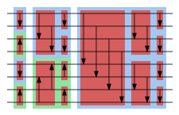
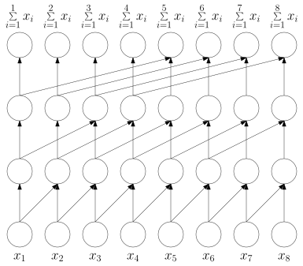
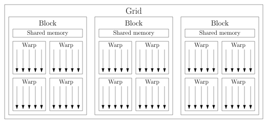

# Algorithms

To simplify the dicussion on the algorithmic choices, we will assume that the goal is to compute the maximizing pessimistic probability of reaching a set of states ``G``, that is, 

```math
\max_{\pi} \; \min_{\eta} \; \mathbb{P}_{\pi,\eta }\left[\omega \in \Omega : \exists k \in [0,K], \, \omega(k)\in G  \right].
```

See [Theory](@ref) for more details on the theory behind IMDPs including strategies and adversaries; in this case the maximization and minimization operators respectively. The algorithms are easily adapted to other specifications, such as minimizing optimistic probability, which is useful for safety, or maximizing pessimitic discounted reward. Assume furthermore that the transition probabilities are represented as a sparse matrix.
This is the most common representation for large models, and the algorithms are easily adapted to dense matrices with the sorting (see [Sorting](@ref)) being shared across states such that parallelizing this has a smaller impact on performance.

## Solving reachability as value iteration
Computing the solution to the above problem can be reframed in terms of value iteration. The value function ``V_k`` is the probability of reaching ``G`` in ``k`` steps or fewer. The value function is initialized to ``V_0(s) = 1`` if ``s \in G`` and ``V_0(s) = 0`` otherwise. The value function is then iteratively updated according to the Bellman equation
```math
\begin{aligned}
    V_{0}(s) &= \mathbf{1}_{G}(s) \\
    V_{k}(s) &= \mathbf{1}_{G}(s) + \mathbf{1}_{S\setminus G}(s) \max_{a \in A} \min_{p_{s,a}\in \Gamma_{s,a}} \sum_{s' \in S} V_{k-1}(s') p_{s,a}(s'),
\end{aligned}
```
where ``\mathbf{1}_{G}(s) = 1``  if ``s \in G`` and ``0`` otherwise is the indicator function for set ``G``. This Bellman update is repeated until ``k = K``, or if ``K = \infty``, the value function converges, i.e. ``V_k = V_{k-1}`` for some ``k``. The value function is then the solution to the problem.
Exact convergence is virtually impossible to achieve in a finite number of iterations due to the finite precision of floating point numbers. Hence, we instead use a residual tolerance ``\epsilon`` and stop when Bellman residual ``V_k - V_{k-1}`` is less than the threshold, ``\|V_k - V_{k-1}\|_\infty < \epsilon``.

In a more programmatic formulation, the algorithm (for ``K = \infty``) can be summarized as follows:

```julia
function value_iteration(system, spec)
    V = initialize_value_function(spec)

    while !converged(V)
        V = bellman_update(V, system)
    end
end
```

## Efficient value iteration

Computing the Bellman update for can be done indepently for each state. 
```julia
function bellman_update(V, system)
    # Thread.@threads parallelize across available threads
    Thread.@threads for s in states(system)
        # Minimize over probability distributions in `Gamma_{s,a}`, i.e. pessimistic
        V_state = minimize_feasible_dist(V, system, s)

        # Maximize over actions
        V[s] = maximum(V_state)
    end
end
```

For each state, we need to compute the minimum over all feasible distributions per state-action pairs and the maximum over all actions for each state.
The minimum over all feasible distributions can be computed as a solution to a Linear Programming (LP) problem, namely

```math
    \begin{aligned}
        \min_{p_{s,a}} \quad & \sum_{s' \in S} V_{k-1}(s') \cdot p_{s,a}(s'), \\
        \quad & \underline{P}(s,a,s') \leq p_{s,a}(s') \leq \overline{P}(s,a,s') \quad \forall s' \in S, \\
        \quad & \sum_{s' \in S} p_{s,a}(s') = 1. \\
    \end{aligned}
```

However, due to the particular structure of the LP problem, we can use a more efficient algorithm: O-maximization, or ordering-maximization [1].
In the case of pessimistic probability, we want to assign the most possible probability mass to the destinations with the smallest value of ``V_{k-1}``, while obeying that the probability distribution is feasible, i.e. within the probability bounds and that it sums to 1. This is done by sorting the values of ``V_{k-1}`` and then assigning state with the smallest value its upper bound, then the second smallest, and so on until the remaining mass must be assigned to the lower bound of the remaining states for probability distribution is feasible.
```julia
function minimize_feasible_dist(V, system, s)
    # Sort values of `V` in ascending order
    order = sortperm(V)

    # Initialize distribution to lower bounds
    p = lower_bounds(system, s)
    rem = sum(p)

    # Assign upper bounds to states with smallest values
    # until remaining mass is zero
    for idx in order
        gap = upper_bounds(system, s)[idx] - p[idx]
        if rem <= gap
            p[idx] += rem
            break
        else
            p[idx] += gap
            rem -= gap
        end
    end

    return p
end
```

We abstract this algorithm into the sorting phase and the O-maximization phase: 
```julia
function minimize_feasible_dist(V, system, s)
    # Sort values of `V` in ascending order
    order = sortstates(V)
    p = o_maximize(system, s, order)
    return p
end
```

When computing computing the above on a GPU, we can and should parallelize both the sorting and the O-maximization phase.
In the following two sections, we will discuss how parallelize these phases.

### Sorting
Sorting in parallel on the GPU is a well-studied problem, and there are many algorithms for doing so. We choose to use bitonic sorting, which is a sorting network that is easily parallelized and implementable on a GPU. The idea is to merge bitonic subsets, i.e. sets with first increasing then decreasing subsets of equal size, of increasingly larger sizes and perform minor rounds of swaps to maintain the bitonic property. The figure below shows 3 major rounds to sort a set of 8 elements (each line represents an element, each arrow is a comparison pointing towards the larger element). The latency[^1] of the sorting network is ``O((\lg n)^2)``, and thus it scales well to larger number of elements. See [Wikipedia](https://en.wikipedia.org/wiki/Bitonic_sorter) for more details.




### O-maximization
In order to parallelize the O-maximization phase, observe that O-maximization implicity implements a cumulative sum according to the ordering over gaps and this is the only dependency between the states. Hence, if we can parallelize this cumulative sum, then we can parallelize the O-maximization phase.
Luckily, there is a well-studied algorithm for computing the cumulative sum in parallel: tree reduction for prefix scan. The idea is best explained with figure below.



Here, we recursively compute the cumulative sum of larger and larger subsets of the array. The latency is ``O(lg n)``, and thus very efficient. See [Wikipedia](https://en.wikipedia.org/wiki/Prefix_sum) for more details. When implementing the tree reduction on GPU, it is possible to use warp shuffles to very efficiently perform tree reductions of up to 32 elements. For larger sets, shared memory to store the intermediate results, which is much faster than global memory. See [CUDA Programming Model](@ref) for more details on why these choices are important.

Putting it all together, we get the following (pseudo-code) algorithm for O-maximization:
```julia
function o_maximize(system, s, order)
    p = lower_bounds(system, s)
    rem = 1 - sum(p)
    gap = upper_bounds(system, s) - p

    # Ordered cumulative sum of gaps
    cumgap = cumulative_sum(gap[order])

    @parallelize for (i, o) in enumerate(order)
        rem_state = max(rem - cumgap[i] + gap[o], 0)
        if gap[o] < rem_state
            p[o] += gap[o]
        else
            p[o] += rem_state
            break
        end
    end

    return p
end
```

## CUDA Programming Model
We here give a brief introduction to the CUDA programming model to understand to algorithmic choices. For a more in-depth introduction, see the [CUDA C++ Programming Guide](https://docs.nvidia.com/cuda/cuda-c-programming-guide/index.html). The CUDA framework is Single-Instruction Multiple-Thread (SIMT) parallel execution platform and Application Programming Interface. This is in contrast to Single-Instruction Multiple-Data where all data must be processed homogeneously without control flow. SIMT makes CUDA more flexible for heterogeneous processing and control flow. The smallest execution unit in CUDA is a thread, which is a sequential processing of instructions. A thread is uniquely identified by its thread index, which allows indexing into the global data for parallel processing. A group of 32 threads[^2] is called a warp, which will be executed _mostly_ synchronously on a streaming multiprocessor. If control flow makes threads in a wrap diverge, instructions may need to be decoded twice and executed in two separate cycles. Due to this synchronous behavior, data can be shared in registers between threads in a warp for maximum performance. A collection of (up to) 1024 threads is called a block, and this is the largest aggregation that can be synchronized. Furthermore, threads in a block share the appropriately named shared memory. This is memory that is stored locally on the streaming multiprocessor for fast access. Note that shared memory is unintuitively faster than local memory (not to be confused with registers) due to local memory being allocated in device memory. Finally, a collection of (up to) 65536 blocks is called the grid of a kernel, which is the set of instructions to be executed. The grid is singular as only a single ever exists per launched kernel. Hence, if more blocks are necessary to process the amount of data, then a grid-strided loop or multiple kernels are necessary. 




[1] M. Lahijanian, S. B. Andersson and C. Belta, "Formal Verification and Synthesis for Discrete-Time Stochastic Systems," in IEEE Transactions on Automatic Control, vol. 60, no. 8, pp. 2031-2045, Aug. 2015, doi: 10.1109/TAC.2015.2398883.

[^1]: Note that when assessing parallel algorithms, the asymptotic performance is measured by the latency, which is the delay in the number of parallel operations, before the result is available. This is in contrast to traditional algorithms, which are assessed by the total number of operations.

[^2]: with consecutive thread indices aligned to a multiple of 32.